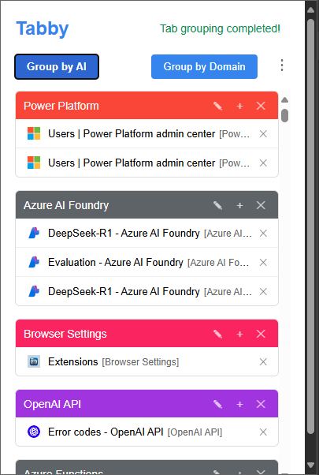
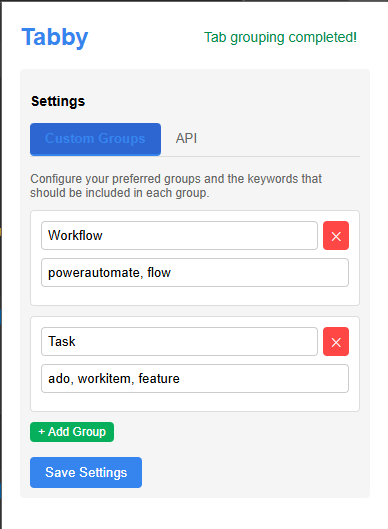

# Tabby - AI-Powered Tab Manager

Tabby is a smart browser extension that revolutionizes how you organize your tabs using AI-powered categorization and intelligent domain-based grouping.

   
   

## Key Features

- 🤖 **AI-Powered Tab Organization** - Intelligently categorizes your tabs based on content
- 🔄 **Smart Domain Grouping** - Automatically groups tabs from the same website
- ⚡️ **Instant Tab Access** - Quick search and switch between tabs
- 🎯 **Custom Group Rules** - Create personalized grouping rules with keywords
- 🔒 **Privacy-Focused** - Your data stays local; API calls only when needed
- ⚙️ **Flexible Configuration** - Customize the extension to work your way

## Quick Installation

### Chrome Web Store (Recommended)
1. Visit the [Chrome Web Store](https://chrome.google.com/webstore) (Coming Soon)
2. Click "Add to Chrome"
3. Confirm the installation

### Manual Installation (Developer Mode)
1. Download this repository
2. Go to `chrome://extensions/` (or equivalent for your browser)
3. Enable "Developer mode"
4. Click "Load unpacked" and select the Tabby folder

## Setup Guide

### Basic Usage
1. Click the Tabby icon in your toolbar
2. Choose your preferred grouping method:
   - 🤖 AI Categorization
   - 🌐 Domain-based Grouping

### AI Feature Setup (Optional)
1. Open Settings (⋮ menu)
2. Enter your OpenAI API details:
   - API Endpoint (default: `https://api.openai.com/v1/chat/completions`)
   - API Key
3. Save changes

### Custom Groups Configuration
1. Navigate to Settings > Custom Groups
2. Add groups with relevant keywords
3. Save to apply custom grouping rules

## Keyboard Shortcuts
- `Alt + T`: Open Tabby popup
- `Alt + G`: Quick group by domain
- `Alt + U`: Ungroup all tabs

## Browser Compatibility
- ✅ Google Chrome (v88+)
- ✅ Microsoft Edge
- ✅ Brave Browser
- ✅ Other Chromium-based browsers

## Troubleshooting

### Common Issues
- **API Not Working**: Verify API key and endpoint
- **Groups Not Forming**: Check browser permissions
- **Custom Rules Not Applied**: Verify keyword formatting

### Need Help?
- 📜 Check our [Wiki](https://github.com/yourusername/tabby/wiki)
- 🐛 Report issues on [GitHub](https://github.com/yourusername/tabby/issues)
- 📧 Contact: [your-support-email]

## Privacy & Security
- ✅ No user data collection
- ✅ Local storage only
- ✅ Optional AI feature with your own API key
- ✅ Open-source code

## Contributing
We welcome contributions! See our [Contributing Guidelines](CONTRIBUTING.md) for details.

## License
MIT License - See [LICENSE](LICENSE) file for details

---

*Made with ❤️ by the Tabby team*
