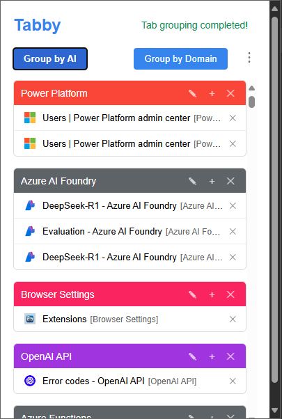
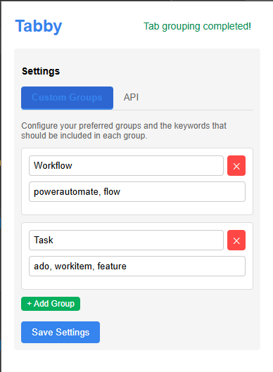

# Tabby - Browser Tab Manager with AI

Tabby is a browser extension that helps you organize your tabs using AI-powered categorization or domain-based grouping.

   
   

## Features

- **Group tabs by domain** - Automatically group tabs from the same domain
- **AI-powered categorization** - Group tabs based on their content using AI
- **Custom grouping rules** - Create your own custom groups with keywords
- **Easy tab management** - Switch, close, and organize tabs from one place

## Installation Instructions

### Chrome / Edge / Brave / Other Chromium-based browsers

1. Download or clone this repository to your local machine
2. Open your browser and navigate to the extensions page:
   - Chrome: `chrome://extensions/`
   - Edge: `edge://extensions/`
   - Brave: `brave://extensions/`
3. Enable "Developer mode" using the toggle in the top-right corner
4. Click "Load unpacked" and select the Tabby folder
5. The Tabby extension icon should now appear in your browser toolbar

## Configuration

### API Settings

To use the AI categorization feature:

1. Click on the Tabby icon in your browser toolbar
2. Click the menu button (⋮) and select "Settings"
3. Enter your OpenAI API endpoint (default: `https://api.openai.com/v1/chat/completions`)
4. Enter your OpenAI API key
5. Click "Save Settings"

### Custom Groups

You can define your own groups to override AI categorization:

1. Open the Tabby settings
2. Click on the "Custom Groups" tab
3. For each group:
   - Enter a group name (e.g., "Work")
   - Enter keywords separated by commas (e.g., "project, report, workflow")
   - Tabs containing these keywords in their titles or URLs will be assigned to this group
4. Click "Save Settings"

## Usage

1. Click on the Tabby icon in your browser toolbar
2. Choose a grouping method:
   - "Group by Domain" - Groups tabs based on their domain names
   - "Group by AI" - Uses AI to categorize tabs by content (requires API key)
3. To ungroup all tabs, click the menu button and select "Ungroup All"
4. To refresh the tab list, click the menu button and select "Refresh"

## Packaging the Extension

To create a distributable package:

1. Zip the entire contents of the Tabby folder:

   - manifest.json
   - popup.html
   - popup.css
   - popup.js
   - images/ (folder with all icons)
   - README.md (optional)

2. The resulting .zip file can be:
   - Uploaded to the Chrome Web Store (requires developer account)
   - Shared with others for manual installation

## Troubleshooting

- **API errors**: Ensure your API key is correct and has sufficient credits/permissions
- **Tabs not grouping**: Make sure you've granted the extension the necessary permissions
- **Custom groups not working**: Check that your keywords match the content of the tabs

## License

This extension is provided as-is under an open-source license.

## Privacy

- This extension requires permissions to access tab information and group tabs
- If using the AI feature, tab information is sent to the configured API endpoint
- No data is collected by the extension developers

For more information or support, please create an issue in the GitHub repository.
